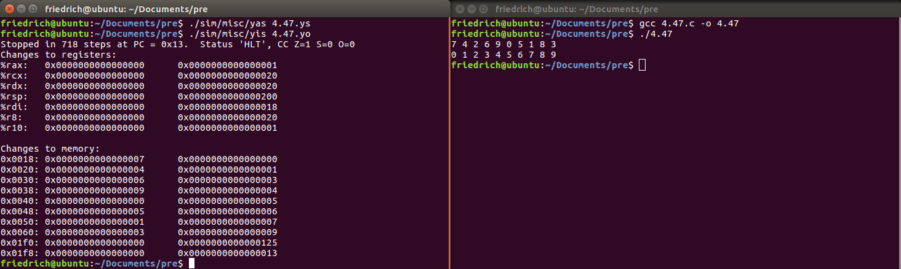
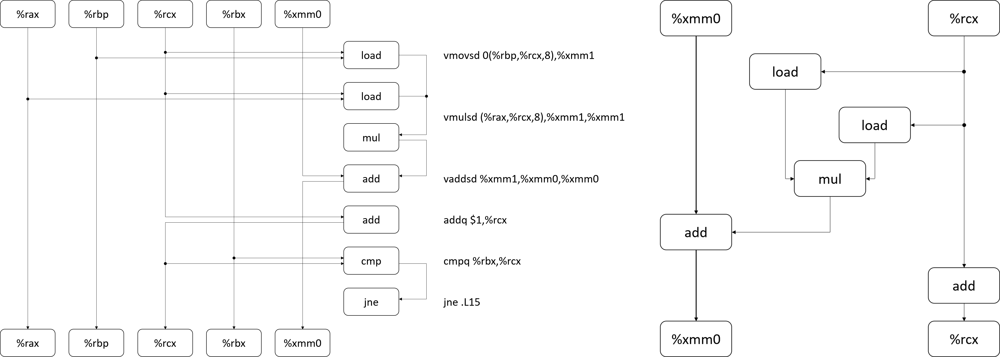

# ICS Homework 5

*Cao Shengcao*

### 4.47

- A. It shouldn't be difficult to write the C code. Here we use a simple array of 10 long integers to test the function.

  ```c
  #include <stdio.h>
  long a[10] = { 7, 4, 2, 6, 9, 0, 5, 1, 8, 3 };  // test array
  void bubble_p(long *data, long count)           // bubblesort using pointers
  {
      long *p, *q, *r, last;
      for (last = count - 1; last > 0; --last)
      {
          r = data + last;                        // p < r instead of i < last
          for (p = data; p < r; ++p)
          {
              q = p + 1;
              if (*q < *p)                        // *q is data[i + 1], and *p is data[i]
              {
                  long t = *q;
                  *q = *p;
                  *p = t;
              }
          }
      }
  }
  int main()
  {
      int i;
      for (i = 0; i < 10; ++i)
          printf("%ld ", a[i]);
      printf("\n");                               // 7 4 2 6 9 0 5 1 8 3
      bubble_p(a, 10);
      for (i = 0; i < 10; ++i)
          printf("%ld ", a[i]);
      printf("\n");                               // 0 1 2 3 4 5 6 7 8 9
      return 0;
  }
  ```

- B. Imitating the Y86-64 code from figure 4-7 (P252) and the C code above, we can also finish the Y86-64 code for this program. Be careful about how we implement for-loops in assembly language. For a `long*` type pointer, `++p` is actually adding $8$ to its value. (It really took me some time to debug this program...)

  ```assembly
      .pos 0

  init:
      irmovq  stack, %rsp
      call    main
      halt

      .align 8
      a:                      # test array
          .quad   7
          .quad   4
          .quad   2
          .quad   6
          .quad   9
          .quad   0
          .quad   5
          .quad   1
          .quad   8
          .quad   3

  bubble_p:
      irmovq  1, %rax
      subq    %rax, %rsi      # %rsi: last = count - 1
      jle     bubble_p_end1

  bubble_p_loop1:
      rrmovq  %rsi, %rax
      addq    %rax, %rax
      addq    %rax, %rax
      addq    %rax, %rax      # %rax: last * 8
      rrmovq  %rdi, %r8
      addq    %rax, %r8       # %r8: r = data + last
      rrmovq  %rdi, %rdx      # %rdx: p = data
      rrmovq  %rdx, %rax
      subq    %r8, %rax
      jge     bubble_p_end2

  bubble_p_loop2:
      irmovq  8, %rcx
      addq    %rdx, %rcx      # %rcx: q = p + 1
      mrmovq  (%rdx), %r9     # %r9: *p
      mrmovq  (%rcx), %r10    # %r10: *q
      rrmovq  %r10, %rax
      subq    %r9, %rax
      jge     no_swap

  swap:
      rmmovq  %r10, (%rdx)
      rmmovq  %r9, (%rcx)     # swap

  no_swap:
      irmovq  8, %rax
      addq    %rax, %rdx      # ++p
      rrmovq  %rdx, %rax
      subq    %r8, %rax
      jl      bubble_p_loop2

  bubble_p_end2:
      irmovq  1, %rax
      subq    %rax, %rsi      # --last
      jg      bubble_p_loop1

  bubble_p_end1:
      ret

  main:
      irmovq  10, %rsi
      irmovq  a, %rdi
      call    bubble_p
      ret

      .pos 0x200

  stack:
  ```

  The Y86-64 simulator can be found at [CSAPP's student site](http://csapp.cs.cmu.edu/3e/students.htm). Running the two programs, we can see the correct results:

  

  You may want to look into the details about how our handwritten Y86-64 assembly code differs from the assembly code generated by GCC. Check this out in `4.47.c` `4.47.s` `4.47.ys` `4.47.yo`.


### 4.56

To implement this so called "BTFNT", we need to modify three parts of our HCL code.

- Fetch stage: Predict the next PC as BTFNT describes. If the prediction were wrong, we must select the correct branch. Note there are two cases.

  ```c
  ## What address should instruction be fetched at
  word f_pc = [
  	# Mispredicted branch.  Fetch at incremented PC
      M_icode == IJXX && M_ifun != UNCOND && M_valE < M_valA && !M_Cnd : M_valA;
      M_icode == IJXX && M_ifun != UNCOND && M_valE >= M_valA && M_Cnd : M_valE;
  	# Completion of RET instruction
  	W_icode == IRET : W_valM;
  	# Default: Use predicted value of PC
  	1 : F_predPC;
  ];

  # Predict next value of PC
  word f_predPC = [
  	# BBTFNT: This is where you'll change the branch prediction rule
      f_icode == IJXX && f_ifun != UNCOND && f_valC < f_valP : f_valC;
      f_icode == IJXX && f_ifun != UNCOND && f_valC >= f_valP : f_valP;
  	f_icode in { IJXX, ICALL } : f_valC;
  	1 : f_valP;
  ];
  ```

- Execute stage: Pass `valC` by calculating `valE = valB + valA = 0 + valC`. (`valP` is merged into `valA`, so we don't need to treat it specially.)

  ```c
  ## Select input A to ALU
  word aluA = [
  	E_icode in { IRRMOVQ, IOPQ } : E_valA;
  	E_icode in { IIRMOVQ, IRMMOVQ, IMRMOVQ, IJXX } : E_valC;
  	E_icode in { ICALL, IPUSHQ } : -8;
  	E_icode in { IRET, IPOPQ } : 8;
  	# Other instructions don't need ALU
  ];

  ## Select input B to ALU
  word aluB = [
  	E_icode in { IRMMOVQ, IMRMOVQ, IOPQ, ICALL, 
  		     IPUSHQ, IRET, IPOPQ } : E_valB;
  	E_icode in { IRRMOVQ, IIRMOVQ, IJXX } : 0;
  	# Other instructions don't need ALU
  ];
  ```

- Controlling: Insert two bubbles almost as the same as before. The conditions are changed.

  ```c
  bool D_bubble =
  	# Mispredicted branch
      (E_icode == IJXX && E_ifun != UNCOND && E_valC < E_valA && !e_Cnd) ||
      (E_icode == IJXX && E_ifun != UNCOND && E_valC >= E_valA && e_Cnd) ||
  	# BBTFNT: This condition will change
  	# Stalling at fetch while ret passes through pipeline
  	# but not condition for a load/use hazard
  	!(E_icode in { IMRMOVQ, IPOPQ } && E_dstM in { d_srcA, d_srcB }) &&
  	  IRET in { D_icode, E_icode, M_icode };

  bool E_bubble =
  	# Mispredicted branch
      (E_icode == IJXX && E_ifun != UNCOND && E_valC < E_valA && !e_Cnd) ||
      (E_icode == IJXX && E_ifun != UNCOND && E_valC >= E_valA && e_Cnd) ||
  	# BBTFNT: This condition will change
  	# Conditions for a load/use hazard
  	E_icode in { IMRMOVQ, IPOPQ } &&
  	 E_dstM in { d_srcA, d_srcB};
  ```

### 5.13

- A. The diagrams are shown below.

  

- B. The lower bound is $3$, because the critical path only has one FP add instruction.

- C. The lower bound is $1$, as the critical path remains the same.

- D. The FP mul instructions can be pipelined. When the loop gets running, the results of FP mul instructions can be obtained in every cycle.

### 5.14

The code using $6\times 1$ loop unrolling:

```c
void inner_loop_unrolling(vec_ptr u, vec_ptr v, data_t *dest)
{
    long i;
    long length = vec_length(u);
    long limit = length - 5;
    data_t *udata = get_vec_start(u);
    data_t *vdata = get_vec_start(v);
    data_t sum = (data_t)0;
    for (i = 0; i < limit; i += 6)
    {
        sum += udata[i] * vdata[i] + udata[i + 1] * vdata[i + 1]
               + udata[i + 2] * vdata[i + 2] + udata[i + 3] * vdata[i + 3]
               + udata[i + 4] * vdata[i + 4] + udata[i + 5] * vdata[i + 5];
    }
    for (; i < length; ++i)
    {
        sum += udata[i] * vdata[i];
    }
    *dest = sum;
}
```

- A. The performance is limited because two load instructions are required every time. Even if the two function units for load work all the time, the CPE can't be less than $1$.
- B. The processor has only one function unit for FP add, which is always in the critical path. Therefore, the CPE can't be less than $3$.

